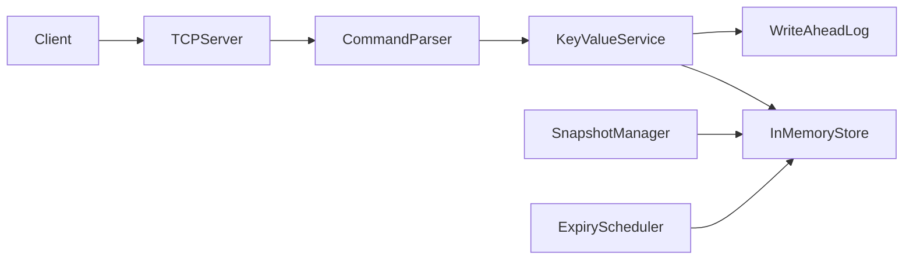
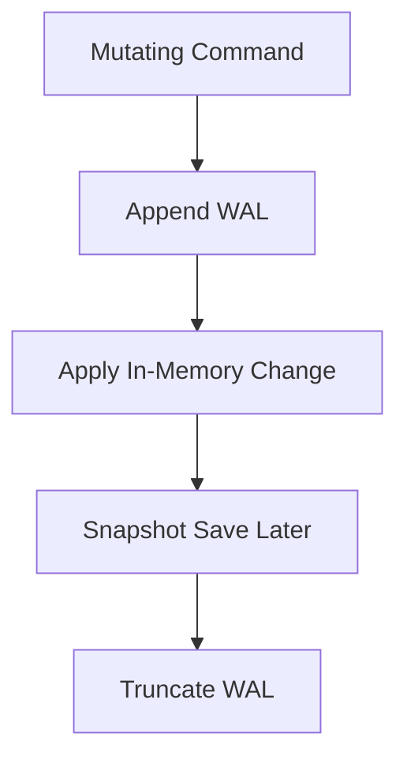
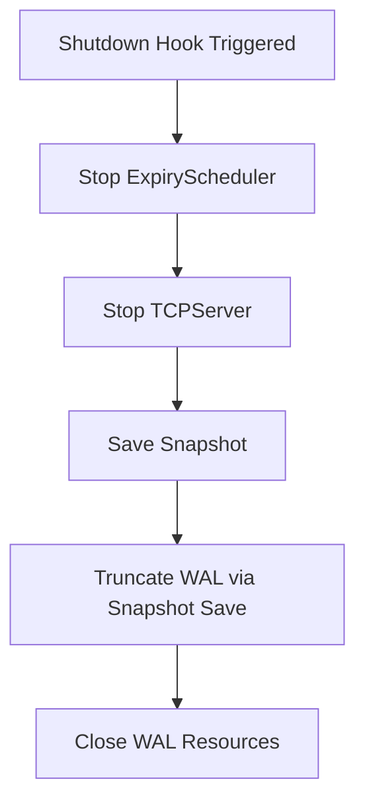
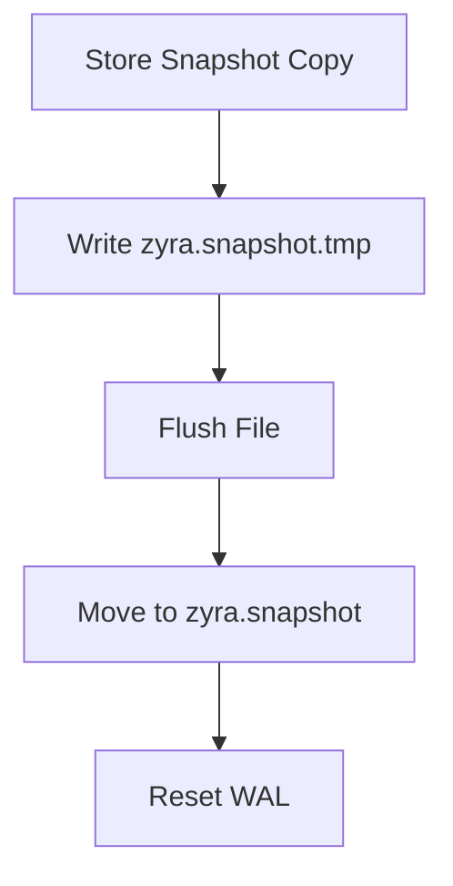
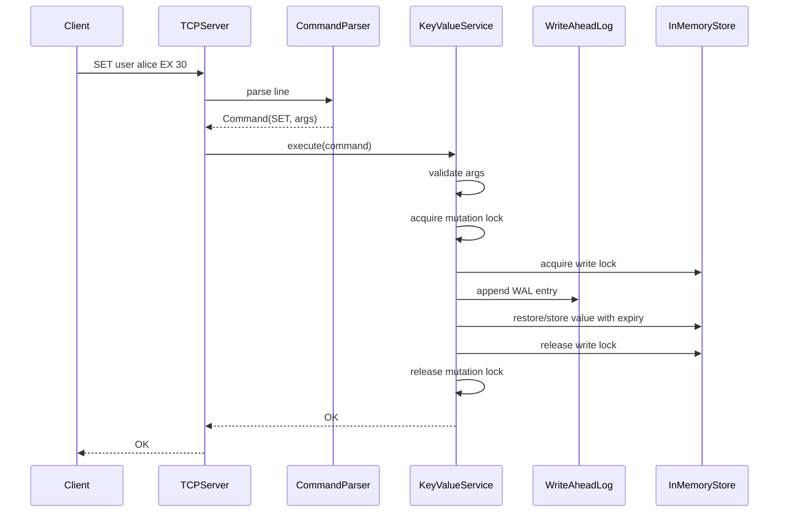
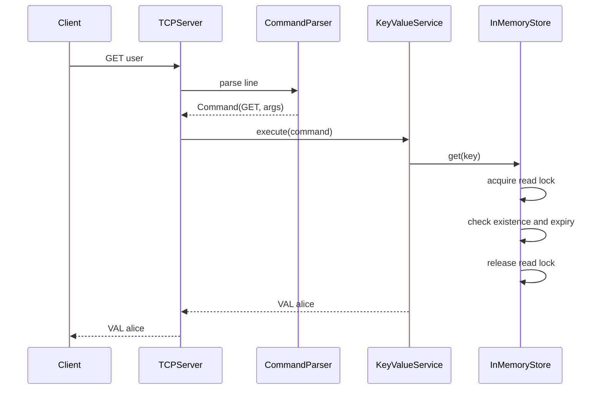
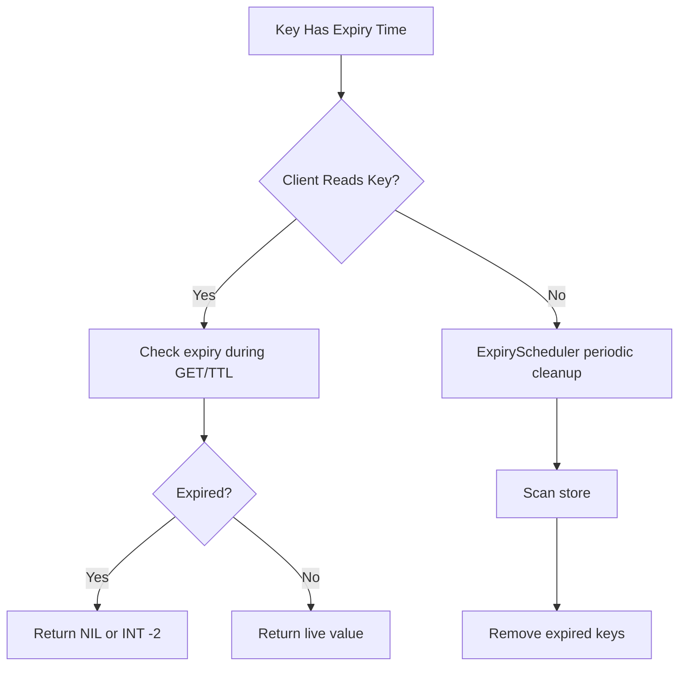

# ZyraDB Technical Documentation

This document is the in-depth technical guide for ZyraDB. It explains the architecture, concepts, algorithms, execution flow, trade-offs, and practical behavior of the system in a way that is meant to be studied, not just skimmed.

The goal of this guide is to help a reader answer four questions clearly:

1. What does ZyraDB do?
2. How is it built internally?
3. Why were these concepts and algorithms chosen?
4. What happens step by step when commands are executed?

## 1. What ZyraDB Is

ZyraDB is a Redis-inspired, in-memory key-value database written in Java 21 using Spring Boot for application bootstrapping. It does not expose REST endpoints. Instead, it uses a custom TCP protocol and a text-based command interface.

ZyraDB supports:

- key-value storage
- multiple concurrent TCP clients
- `SET`, `GET`, `DEL`, `EXPIRE`, `TTL`, `INFO`, `QUIT`
- TTL expiration
- background cleanup of expired keys
- persistence through snapshot + write-ahead log
- replay-based recovery on restart
- graceful shutdown lifecycle

Even though it is compact, it demonstrates many of the ideas found in real storage engines and caching systems.

## 1.1 Theoretical Background

Before diving into the code, it helps to understand the class of system ZyraDB belongs to.

A key-value database is one of the simplest database models. Instead of tables, joins, and schemas, the system stores data as:

```text
key -> value
```

This model is powerful because many real workloads need very fast access by identifier:

- session storage
- caching
- configuration lookup
- counters
- temporary tokens
- metadata lookup

The main theoretical properties of a key-value engine are:

- direct lookup by key
- simple mutation semantics
- low overhead per operation
- high importance of latency and concurrency

ZyraDB is specifically an in-memory engine, which means the primary copy of active data lives in RAM. This gives speed, but introduces the classical problem of durability:

```text
memory is fast
memory is volatile
volatile data disappears on crash or restart
```

That is why ZyraDB combines an in-memory state model with persistence techniques such as write-ahead logging and snapshots.

## 1.2 Why a Mini Storage Engine Is Educationally Valuable

Many projects show business logic. Fewer projects show systems logic.

ZyraDB is valuable as a learning system because it exposes the internal concerns that real engines must solve:

- how commands arrive from the network
- how raw bytes become structured operations
- how shared memory is protected under concurrency
- how time-based expiration works
- how recent writes survive restart
- how shutdown is made safe

In other words, ZyraDB teaches not only what a database does, but what a database must *guarantee*.

## 2. High-Level Architecture

At a high level, ZyraDB is a pipeline:



The core runtime path is:

- clients connect over TCP
- the server reads raw text commands
- the parser turns text into structured commands
- the service validates and executes commands
- the store manages in-memory state
- the WAL and snapshot system protect data across restart

## 3. Main Components

### 3.1 TCP Server Layer

Relevant file: [TCPServer.java](/src/main/java/com/zyra/tcp/TCPServer.java)

The TCP server is responsible for:

- opening a `ServerSocket`
- listening on port `6380` by default
- accepting client connections
- assigning client work to a thread pool
- sending line-based responses
- shutting down sockets and workers safely

This is not an HTTP server. The system speaks a simple custom text protocol.

Example client interaction:

```text
SET user alice
GET user
TTL user
QUIT
```

Each line is read as a command. Each response is also a single line.

### 3.2 Parser Layer

Relevant file: [CommandParser.java](/src/main/java/com/zyra/parser/CommandParser.java)

The parser converts raw input into a `Command` object.

Input:

```text
SET session token123 EX 30
```

Internal representation:

```text
name = SET
args = [session, token123, EX, 30]
```

The parser keeps the command surface strict and predictable by accepting canonical command names directly.

### 3.3 Service Layer

Relevant file: [KeyValueService.java](/src/main/java/com/zyra/service/KeyValueService.java)

The service layer is where command semantics live.

It is responsible for:

- validating command shape
- rejecting invalid input
- formatting consistent responses
- coordinating writes so durability and memory stay aligned

This is the logical brain of command execution.

### 3.4 Store Layer

Relevant file: [InMemoryStore.java](/src/main/java/com/zyra/store/InMemoryStore.java)

The store is the in-memory data structure holding all keys and values.

It manages:

- current value
- expiry timestamp
- read and write synchronization
- snapshot generation
- expired-key cleanup

Internally it uses:

- `HashMap<String, ValueWrapper>`
- `ReentrantReadWriteLock`

### 3.5 Durability Layer

Relevant files:

- [WriteAheadLog.java](/src/main/java/com/zyra/store/WriteAheadLog.java)
- [SnapshotManager.java](/src/main/java/com/zyra/store/SnapshotManager.java)

This layer gives ZyraDB restart safety.

It uses two persistence mechanisms:

- WAL for recent mutations
- snapshot for compact full-state persistence

These work together:



### 3.6 Background Maintenance

Relevant file: [ExpiryScheduler.java](/src/main/java/com/zyra/scheduler/ExpiryScheduler.java)

The scheduler periodically scans for expired keys and removes them.

This prevents expired data from living in memory forever when it is not actively read.

### 3.7 Application Lifecycle

Relevant file: [ZyraDbApplication.java](/src/main/java/com/zyra/ZyraDbApplication.java)

The application class coordinates:

- startup loading
- recovery
- background scheduling
- TCP server startup
- shutdown ordering

This is where ZyraDB behaves like an engine rather than only a collection of classes.

## 4. Data Model

Each stored key maps to a `ValueWrapper`.

Simplified structure:

```java
class ValueWrapper {
    private final String value;
    private final long expiryTime;
}
```

Meaning of `expiryTime`:

- `-1` means no expiration
- positive timestamp means absolute expiration time in epoch milliseconds

Example:

```text
SET user alice
```

Stored internally as:

```text
key = user
value = alice
expiryTime = -1
```

Example with TTL:

```text
SET token abc EX 10
```

Stored as:

```text
key = token
value = abc
expiryTime = currentTime + 10000 ms
```

This model is simple and effective because value and expiration metadata travel together.

## 4.1 Theory of the Data Model

The `ValueWrapper` structure is a small example of metadata co-location.

Co-location means the main value and its control information are stored together. Here, the control information is:

- whether the key expires
- when it expires

This has an important theoretical advantage:

- all information needed to validate a key is available at the point of lookup

If value and TTL were stored separately, the engine would need extra coordination between two structures, which increases the chance of inconsistency and makes reads more complex.

This design reflects a common systems principle:

```text
keep data that is always used together physically or logically together
```

That reduces coordination cost and simplifies correctness.

## 5. Supported Commands and Meaning

### 5.1 `SET key value`

Stores a value without expiration.

Example:

```text
SET name Zyra
```

Response:

```text
OK
```

### 5.2 `SET key value [EX seconds]`

Stores a value with a TTL.

Here, `EX` is part of the `SET` command syntax. It is not a standalone command.

Example:

```text
SET token abc123 EX 20
```

Response:

```text
OK
```

### 5.3 `GET key`

Returns:

- `VAL <value>` if the key exists and is still valid
- `NIL` if missing or expired

Example:

```text
GET token
VAL abc123
```

### 5.4 `DEL key`

Deletes a key.

Returns:

- `INT 1` if deleted
- `INT 0` if not found

### 5.5 `EXPIRE key seconds`

Adds a TTL to an existing key.

This is separate from `EX` in `SET`. Use `EXPIRE` when the key already exists and you only want to change its expiration.

Returns:

- `INT 1` if the key exists and expiry was applied
- `INT 0` if the key does not exist

### 5.6 `TTL key`

Returns:

- `INT -1` if the key exists with no expiry
- `INT -2` if the key does not exist or is expired
- `INT N` if `N` seconds remain

### 5.6.1 `EX` vs `EXPIRE`

- `EX` is only used inside `SET`, for example `SET token abc EX 30`
- `EXPIRE` is a standalone command, for example `EXPIRE token 30`

### 5.7 `INFO`

Returns lightweight engine metadata.

Example:

```text
INFO keys=8 uptime=91
```

### 5.8 `QUIT`

Ends the current client session.

Response:

```text
BYE
```

## 6. Core Concepts Used in ZyraDB

This section explains the important concepts used in the project and why they matter.

## 6.0 Foundational Systems Theory

Before looking at the implementation-specific concepts, there are a few foundational systems ideas that apply across the whole project.

### State

A database is a state machine. Its state is the total set of currently stored keys, values, and expirations.

Every valid command changes or observes that state.

Examples:

- `SET` changes state
- `DEL` changes state
- `EXPIRE` changes state
- `GET` observes state
- `TTL` observes state

This framing is useful because correctness can be described as:

```text
for every command, the system moves from one valid state to another valid state
```

### Invariants

An invariant is something that must always remain true.

Examples of important invariants in ZyraDB:

- a key maps to at most one current value
- an expired key must not be returned as live data
- a WAL replay must never corrupt already valid state
- a snapshot must represent only live entries
- a write command must not leave memory and durability out of sync

Thinking in invariants is a strong systems-engineering habit because it helps identify where races and bugs can appear.

### Consistency at the Engine Level

This is not distributed-systems consistency. It is local engine consistency.

In ZyraDB, local consistency means:

- the in-memory store should remain structurally valid
- the command response should reflect the logical result of the operation
- persistence state should remain recoverable

For example, if a client receives `OK` for a mutation, the engine should not end up in a state where that mutation is neither in memory nor recoverable from the WAL.

### 6.1 Raw TCP Protocol

Most beginner backend projects expose HTTP endpoints. ZyraDB instead communicates through raw TCP sockets.

Why this matters:

- databases often use their own protocol
- command processing becomes explicit
- the project teaches network programming closer to real engine design

Conceptually:

```text
client opens socket
client sends text line
server reads line
server processes command
server sends response line
```

This gives direct control over the transport layer.

#### Theory

TCP is a byte-stream transport protocol. It guarantees ordered delivery of bytes between two endpoints, but it does not preserve message boundaries by itself. That means an application protocol must decide how messages begin and end.

ZyraDB uses a simple line-delimited protocol:

```text
one command per line
one response per line
```

This is a classic framing strategy. Framing is the process of deciding how the receiver knows when one message ends and the next begins.

Alternative framing strategies include:

- fixed-size messages
- length-prefixed frames
- delimiter-based frames

Line framing is easy to understand and suitable for a human-readable educational protocol.

### 6.2 Structured Command Parsing

The parser separates syntax from behavior.

Without parsing, execution code would have to split strings and interpret tokens everywhere. That becomes hard to maintain.

Instead:

```text
Raw Input -> CommandParser -> Command -> KeyValueService
```

Benefits:

- cleaner execution code
- easier validation
- simpler testing
- easier alias support

#### Theory

Parsing is the bridge between syntax and semantics.

- syntax answers: "What did the user type?"
- semantics answer: "What does that input mean?"

Keeping those two concerns separate is an important compiler and interpreter principle. Even in a small database, this matters because command handling becomes much more reliable when syntax errors are caught before semantic execution begins.

### 6.3 In-Memory Storage

ZyraDB stores active data in memory for fast access.

Why in-memory design matters:

- low-latency reads and writes
- simple storage model for learning
- good fit for cache/database hybrid concepts

The trade-off is that memory alone is not durable, which is why persistence mechanisms are added separately.

#### Theory

In-memory systems optimize for latency because RAM access is dramatically faster than disk access. The theory trade-off is straightforward:

```text
RAM gives speed
Disk gives persistence
```

A practical engine therefore has to decide which data lives in memory, which operations must reach disk, and when that happens.

ZyraDB chooses:

- active working state in memory
- recent durability via WAL
- longer-lived compact state via snapshot

That is a very common storage-engine decomposition.

### 6.4 Read/Write Concurrency Control

The store uses `ReentrantReadWriteLock`.

This allows:

- multiple readers at the same time
- only one writer at a time
- no readers while a write is actively changing shared state

Why this is better than one coarse lock:

- reads are common and should not always block each other
- writes still need exclusivity
- it models a real systems trade-off between safety and throughput

Conceptual lock behavior:

```text
GET / TTL / size / snapshot:
  acquire read lock
  read shared state
  release read lock

SET / DEL / EXPIRE / cleanup:
  acquire write lock
  modify shared state
  release write lock
```

#### Theory

Concurrency control exists to prevent race conditions.

A race condition happens when the result of a program depends on the uncontrolled timing of threads.

Example race:

```text
Thread A reads key x
Thread B deletes key x
Thread A continues as if x still exists
```

Without proper synchronization, the system can observe impossible intermediate states.

Read-write locks are based on the idea that not all operations conflict equally:

- read vs read: usually safe together
- write vs write: unsafe together
- read vs write: unsafe if write is modifying shared state

This is why a read-write lock can improve concurrency compared with a single mutual exclusion lock.

### 6.5 Atomic Write Path

One of the most important concepts in ZyraDB is that a logical write command is larger than a single store method.

For `SET`, the real operation is:

```text
validate input
serialize the mutation boundary
write WAL record
apply memory change
return response
```

If WAL append and store mutation are not coordinated, a crash or race can leave the system inconsistent.

That is why mutating commands are serialized in the service layer before the in-memory store is changed.

#### Theory

Atomicity means an operation behaves as if it happened all at once, even if internally it is composed of multiple steps.

In ZyraDB, a mutating command is a multi-step process:

- validate input
- construct persistence record
- write persistence record
- apply memory mutation
- return a result

Theoretical problem:

```text
if step 3 happens but step 4 does not, recovery behavior changes
if step 4 happens but step 3 does not, durability is broken
```

So the engine must define a safe logical boundary around the whole mutation. This is a classic example of lifting atomicity above a single data-structure method and treating the whole command as the unit of correctness.

### 6.6 Passive Expiration

Passive expiration means a key is checked for expiry when someone tries to read it.

Example:

```text
SET temp data EX 3
```

Four seconds later:

```text
GET temp
NIL
```

Even if the cleanup scheduler has not run yet, the key still behaves as expired.

This makes command results correct even when cleanup is delayed.

#### Theory

Passive expiration is demand-driven invalidation. A key is checked only when someone interacts with it.

Its main advantage is efficiency:

- no background work is required to maintain correctness of reads

Its main downside is memory retention:

- if a key is never read again, it can remain in memory past its expiration time unless some active cleanup mechanism also exists

This is why many real caches combine passive and active expiration.

### 6.7 Active Expiration

Active expiration means the system periodically scans for expired keys and removes them from memory.

This is done by `ExpiryScheduler`.

Why it exists:

- avoids indefinite accumulation of expired entries
- keeps memory cleaner
- complements passive expiration

So ZyraDB uses both:

- passive expiration for correctness on access
- active expiration for cleanup efficiency

#### Theory

Active expiration is proactive invalidation.

The system periodically spends work to reclaim space and remove stale entries even when no client touches them. This introduces a scheduling trade-off:

- scan too often: more CPU overhead
- scan too rarely: more stale memory retained

ZyraDB chooses a simple fixed-rate scheduler because it is easy to understand and deterministic enough for an educational project.

### 6.8 Write-Ahead Logging

Write-ahead logging is a standard durability technique.

Idea:

- record mutations to a durable log
- if the process restarts, replay the log

In ZyraDB, WAL entries are appended to `zyra.wal`.

Example logical WAL records:

```text
SET|<encoded-key>|<encoded-value>|<expiry-time>
DEL|<encoded-key>
```

Why the values are encoded:

- keys and values may contain separators like `|`
- Base64 makes line parsing safer and simpler

#### Theory

The core theory behind write-ahead logging is recovery ordering.

If a system updates memory and crashes before any durable record exists, the update is lost. If it records the change durably first, recovery has enough information to reconstruct the change later.

This is the reason for the phrase "write-ahead":

```text
the durable intent of the change must exist before the system forgets the change
```

WAL is one of the most important ideas in database internals because it separates:

- fast operational state
- durable recovery state

and connects them through replay.

### 6.9 Snapshot Persistence

A snapshot is a compact serialized copy of the current live store.

Snapshots solve a practical problem:

- if WAL keeps growing forever, startup replay becomes slower and slower

The solution:

```text
write snapshot of current state
truncate WAL
restart from snapshot + smaller WAL
```

This is why snapshots and WAL usually work together.

#### Theory

WAL alone is enough for recovery, but not always enough for efficiency.

If every command since the beginning of time must be replayed, startup cost grows with history. Snapshots reduce recovery cost by compressing many past mutations into one base image.

This leads to the classic recovery model:

```text
base snapshot + recent log tail
```

Theoretical benefit:

- startup cost depends mostly on recent activity, not full history

This is a form of log compaction at the system level.

### 6.10 Recovery by Replay

When the application starts:

```text
load snapshot
replay WAL
start accepting traffic
```

This means:

- snapshot gives a recent base state
- WAL re-applies newer mutations

Recovery is not just loading a file. It is reconstructing the most recent valid engine state.

#### Theory

Replay is deterministic state reconstruction.

If the same valid operations are applied in the same order to the same base state, the resulting state should be the same. This is why logs are powerful: they preserve ordered intent.

In a well-designed recovery system:

- ordering matters
- malformed records must not corrupt good state
- the replay mechanism should be idempotent or at least well-scoped to a single recovery pass

ZyraDB keeps replay simple by using ordered, line-based records and direct store reapplication.

### 6.11 Corruption Tolerance

Real systems can crash while writing the last line of a log file. If recovery crashes on that broken line, the engine becomes fragile.

ZyraDB avoids this by skipping malformed WAL lines during replay.

That means:

- startup is more resilient
- one bad record does not destroy the whole recovery process

#### Theory

Crash tolerance is about maximizing successful recovery under imperfect conditions.

A robust recovery system does not assume the last operation completed perfectly. It assumes that the last record may be:

- truncated
- partially flushed
- malformed

The theoretical principle here is graceful degradation:

```text
recover as much valid state as possible
instead of rejecting all recovery
```

That is almost always better operationally than an all-or-nothing startup model for a small engine.

### 6.12 Graceful Shutdown

Graceful shutdown is part of data safety.

ZyraDB performs shutdown in an ordered way:



This order matters because the server should stop accepting writes before snapshot and WAL compaction happen.

#### Theory

Shutdown is a transition from live mutable state to stable persisted state.

The ordering is a coordination problem:

- stop new work
- settle current state
- persist it
- release resources

If persistence occurs before write admission is stopped, the engine risks taking a snapshot of an unstable boundary. If resources are closed too early, required cleanup work cannot finish. So shutdown is an algorithmic ordering problem, not just an operational detail.

## 7. Algorithms Used

This section focuses on the actual algorithms and the reasoning behind them.

## 7.0 Theory of Algorithm Choice in ZyraDB

ZyraDB intentionally uses simple, transparent algorithms rather than highly optimized but harder-to-explain ones.

This reflects a useful engineering principle:

```text
an algorithm is not only chosen for asymptotic performance
it is also chosen for clarity, correctness, maintainability, and project goals
```

For a compact educational engine, the best algorithm is often the simplest one that preserves the required guarantees.

### 7.1 TTL Computation Algorithm

Relevant code area: [InMemoryStore.java](/src/main/java/com/zyra/store/InMemoryStore.java)

Goal:

- return TTL in seconds
- avoid under-reporting remaining time

Logic:

```text
remainingMillis = expiryTime - currentTime
if remainingMillis <= 0:
    return -2
else:
    return ceil(remainingMillis / 1000)
```

Implementation idea:

```java
(remainingMillis + 999) / 1000
```

Why this algorithm is used:

- `1500 ms` should feel like `2 seconds`, not `1`
- clients expect TTL to be rounded up, not truncated down

Worked example:

```text
expiryTime = now + 2500 ms
remainingMillis = 2500
ttl = (2500 + 999) / 1000 = 3
```

The underlying mathematical idea is ceiling division:

```text
ceil(a / b)
```

In integer arithmetic, ceiling division is often implemented with:

```text
(a + b - 1) / b
```

Here:

- `a = remainingMillis`
- `b = 1000`

This is a small but important example of using arithmetic transformation to preserve user-facing semantics.

### 7.2 Expired-Key Cleanup Algorithm

Relevant code area: [InMemoryStore.java](/src/main/java/com/zyra/store/InMemoryStore.java)

Goal:

- remove expired keys from memory

Algorithm:

```text
acquire write lock
iterate over all entries
if entry.expiryTime is expired:
    remove entry
count removals
return count
```

Pseudo-code:

```text
removed = 0
for each entry in store:
    if entry.isExpired():
        remove entry
        removed++
```

Complexity:

- time: `O(n)`
- space: `O(1)` extra, excluding iterator overhead

Why it is acceptable here:

- simple
- safe
- easy to reason about

Possible future alternatives:

- min-heap by expiry time
- timing wheel
- probabilistic sampling

The theoretical trade-off here is between:

- exactness with full scan
- efficiency with auxiliary indexing

Full scan is exact and simple, but linear. A min-heap or timing wheel may reduce unnecessary scanning, but adds maintenance complexity and more places where bugs can hide.

### 7.3 Snapshot Creation Algorithm

Relevant code area: [SnapshotManager.java](/src/main/java/com/zyra/store/SnapshotManager.java)

Goal:

- persist a stable copy of live in-memory state

Algorithm:

```text
1. request snapshot data from store
2. write entries to temp file
3. flush temp file
4. move temp file to final snapshot file
5. truncate WAL
```

Why a temp file is used:

- if the process fails while writing, the old snapshot is not immediately destroyed
- file replacement is safer than writing directly into the final file

Theoretical principle:

- never overwrite a known-good persistent structure with partially written state if you can avoid it

This is related to safe replace patterns used in many systems:

```text
write new version elsewhere
make new version visible only after it is complete
```

This pattern reduces the probability of turning a recoverable crash into unrecoverable on-disk corruption.

Flow:



### 7.4 WAL Replay Algorithm

Relevant code area: [WriteAheadLog.java](/src/main/java/com/zyra/store/WriteAheadLog.java)

Goal:

- rebuild state from recent log entries

Algorithm:

```text
if WAL file exists:
    open file
    for each line:
        try to parse and replay it
        if line is corrupted:
            skip it
```

Pseudo-code:

```text
for line in wal:
    try:
        replay(line)
    catch:
        continue
```

Why this is important:

- crash tolerance
- partial writes do not block recovery
- startup remains robust

The deeper theory here is log-structured recovery:

- history is preserved as an ordered mutation stream
- current state can be reconstructed by applying the history

This is one of the core ideas behind many storage engines and event-sourced systems.

### 7.5 Command Replay Algorithm

Relevant code area: [CommandExecutor.java](/src/main/java/com/zyra/store/CommandExecutor.java)

This class interprets replay commands that are not already handled directly in specialized WAL parsing.

Algorithm idea:

```text
parse line to command
switch on command name
reapply store mutation
ignore invalid forms
```

This keeps recovery logic modular and easier to extend.

It also shows a separation-of-concerns principle:

- WAL file reading decides *what lines exist*
- replay decoding decides *what each line means*
- store methods decide *how state changes*

### 7.6 Concurrency Control Algorithm

Relevant code areas:

- [KeyValueService.java](/src/main/java/com/zyra/service/KeyValueService.java)
- [InMemoryStore.java](/src/main/java/com/zyra/store/InMemoryStore.java)

Goal:

- allow safe reads and writes under concurrency
- keep `WAL + memory` consistent

Algorithm for reads:

```text
acquire store read lock
read current state
release read lock
```

Algorithm for writes:

```text
acquire mutation lock
acquire store write lock
append WAL
apply in-memory mutation
release store write lock
release mutation lock
```

Why this design works:

- reads can happen concurrently
- writes are serialized
- store integrity is protected
- durability record and memory update remain in the same logical critical section

From a theory perspective, this is layered synchronization:

- store-level locking protects the data structure
- command-level mutation locking protects the logical write transaction

This is stronger than relying on only one layer when the real correctness boundary spans both persistence and memory mutation.

### 7.7 Startup Recovery Algorithm

Relevant code area: [ZyraDbApplication.java](/src/main/java/com/zyra/ZyraDbApplication.java)

Startup sequence:

```text
load snapshot
replay WAL
start expiry scheduler
start TCP server
```

This order is intentional:

- load base state first
- then apply newer mutations
- only after recovery is complete should the server accept traffic

### 7.8 Shutdown Algorithm

Shutdown sequence:

```text
stop scheduler
stop TCP server
save snapshot
close WAL
```

Why this order is correct:

- new writes are stopped first
- a final stable snapshot is taken next
- resources are closed last

This reduces the risk of write-loss windows during normal shutdown.

Theoretical insight:

This is effectively a short termination protocol. The system is not just "stopping"; it is converting a live concurrent process into a safe persisted endpoint through ordered coordination.

## 8. Detailed Execution Flows

### 8.1 Flow of `SET key value EX 30`



### 8.2 Flow of `GET key`



### 8.3 Flow of Expiration

Two paths can make a key disappear:

1. passive expiration during read
2. active cleanup by scheduler

Diagram:



## 9. Worked Examples

## 9.0 Theory-to-Implementation Mapping

One of the easiest ways to understand systems design is to map abstract guarantees to concrete examples.

The pattern below is useful:

- identify the guarantee
- identify the failure risk
- identify the mechanism that protects against that risk

Example:

```text
Guarantee: reads should not return expired keys
Risk: old entries remain in memory
Mechanism: passive expiration + active cleanup
```

Another example:

```text
Guarantee: recent writes survive restart
Risk: in-memory state disappears on shutdown or crash
Mechanism: WAL replay + snapshot load
```

### 9.1 Example: Normal Write and Read

Command sequence:

```text
SET a 1
GET a
```

Expected behavior:

```text
OK
VAL 1
```

Internal state after `SET a 1`:

```text
store["a"] = ValueWrapper("1", -1)
```

WAL entry shape:

```text
SET|<base64(a)>|<base64(1)>|-1
```

### 9.2 Example: TTL Life Cycle

Command sequence:

```text
SET session token EX 5
TTL session
```

Possible output immediately:

```text
OK
INT 5
```

After 2 seconds:

```text
TTL session
INT 3
```

After expiration:

```text
GET session
NIL
```

### 9.3 Example: Recovery Scenario

Suppose these mutations happened before shutdown:

```text
SET user alice
SET token abc EX 30
DEL user
```

What recovery does:

```text
1. load snapshot base state
2. replay WAL
3. rebuild latest live keys
4. skip broken records if any
```

If the last WAL line is half-written, recovery still continues with valid earlier lines.

### 9.4 Example: Concurrent Write Race

Assume 10 clients all do:

```text
SET race valueX
```

ZyraDB does not guarantee which final value wins.

It does guarantee:

- one final readable value
- no broken partial memory state
- no interleaving that breaks WAL and store consistency

That is the correct concurrency guarantee for this type of command race.

## 10. Design Decisions and Trade-Offs

### 10.1 Why `HashMap` Instead of `ConcurrentHashMap`

Using `HashMap` with explicit locking makes synchronization policy visible and easier to teach.

Pros:

- clearer locking model
- easier to reason about full-state operations like snapshot and cleanup

Cons:

- less built-in concurrency than specialized concurrent containers

### 10.2 Why Thread-Per-Connection

Pros:

- simple mental model
- easy debugging
- easy to connect socket lifetime to execution lifetime

Cons:

- not ideal for extremely high connection counts
- an NIO/event-loop model would scale further

### 10.3 Why Snapshot + WAL Together

Pros:

- demonstrates real durability concepts
- keeps restart reasonably fast
- keeps implementation understandable

Cons:

- not as advanced as segmented logs or page-based storage

### 10.4 Why Full Scan for Expiration

Pros:

- easy to implement
- very clear behavior

Cons:

- `O(n)` cleanup cost
- less optimal than time-indexed expiration structures

## 11. How the Test Suite Demonstrates Correctness

Relevant tests:

- [CommandParserTest.java](/src/test/java/com/zyra/parser/CommandParserTest.java)
- [KeyValueServiceTest.java](/src/test/java/com/zyra/service/KeyValueServiceTest.java)
- [InMemoryStoreTest.java](/src/test/java/com/zyra/store/InMemoryStoreTest.java)
- [StoreConcurrencyTest.java](/src/test/java/com/zyra/store/StoreConcurrencyTest.java)
- [WriteAheadLogTest.java](/src/test/java/com/zyra/store/WriteAheadLogTest.java)
- [TCPServerIntegrationTest.java](/src/test/java/com/zyra/tcp/TCPServerIntegrationTest.java)
- [FullSystemTcpFlowTest.java](/src/test/java/com/zyra/tcp/FullSystemTcpFlowTest.java)

What they cover:

- parsing behavior
- command validation
- TTL rules
- concurrency safety
- scheduler cleanup
- persistence and replay
- end-to-end TCP behavior

The full-system TCP flow test is especially important because it verifies the project from the outside, like a real client would use it.

## 12. Roadmap Mapping

This documentation intentionally starts the roadmap discussion from the parser and engine-building phases onward.

### Phase 1: Command Pipeline and Core Store

- parser creation
- command representation
- service-driven execution
- in-memory key-value state

### Phase 2: Expiration and Concurrency

- delete and expire support
- TTL semantics
- passive + active expiration
- thread-safety improvements
- race handling

### Phase 3: Durability and Lifecycle

- WAL and replay
- snapshot save/load
- corruption tolerance
- graceful shutdown
- documentation and project polish

### Future Roadmap Areas

The original broader roadmap also mentioned LRU and optimization-focused directions. Those remain future enhancements rather than current implemented functionality.

## 13. Suggested Future Extensions

Natural next steps for ZyraDB:

- RESP-compatible protocol
- LRU or LFU eviction
- append-only log segments
- periodic snapshot scheduling
- replication
- authentication
- metrics and tracing
- performance benchmarking

## 14. Summary

ZyraDB is valuable because it combines multiple foundational systems ideas in one compact codebase:

- socket-based protocol handling
- structured command parsing
- stateful in-memory storage
- concurrency control
- TTL semantics
- durability through WAL
- snapshot-based recovery
- lifecycle-safe shutdown

If you understand how ZyraDB works internally, you understand the core mechanics behind many real caches and storage systems.
